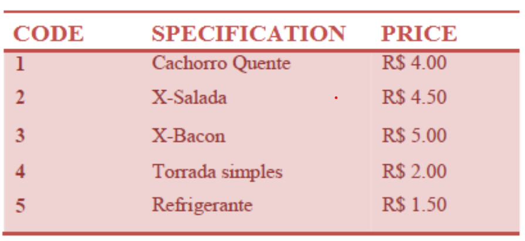
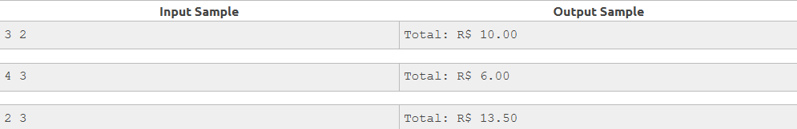

# SNACK 🍰

Using the following table, write a program that reads a code and the amount of an item. After, print the value to pay.

## Input

The input files contains two integer numbers **X** and **Y**. **X** is the product code and **Y** is the quantity of this item according to the above table.

## Output

The output must be a message "Total: R$ " followed by the total value to be paid, with 2 digits after the decimal point. 

