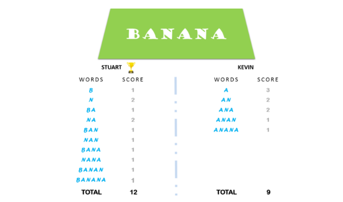

# The Minion Game 🍌

Kevin and Stuart want to play the 'The Minion Game'. The rules of the game are:

## 🍌 Game Rules

* Both players are given the same String, S.
* Both players have to make substrings using the letters os the String S.
* Stuart has to make words starting with consonants.
* Kevin has to make words starting with vowels.
* The game ends when both players have made all possible substrings.  

## 🍌 Scoring

A player gets +1 point for each ocurrance of the sustring in the String S. 

**for exemple**

String S = BANANA
Kevin´s vowel beginning word = ANA
Here, ANA occurs twice in BANANA. Hence, Kevin will get 2 points.

For better understanding, see the image below:

## 🍌 Input

BANANA

## 🍌 Output

Stuart 12. 